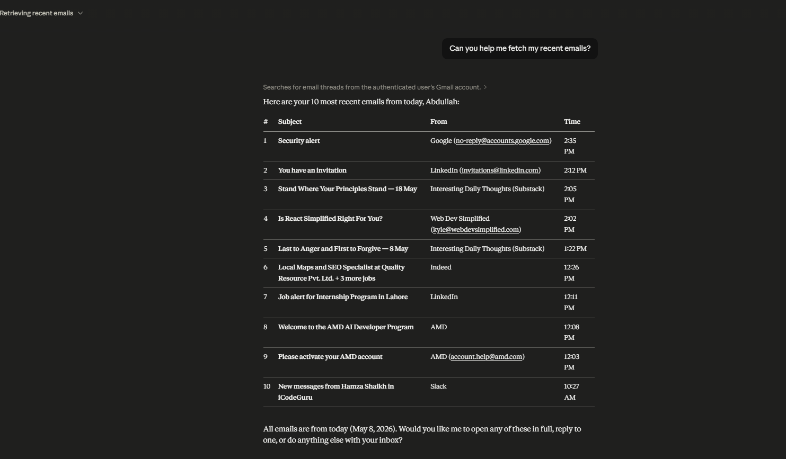
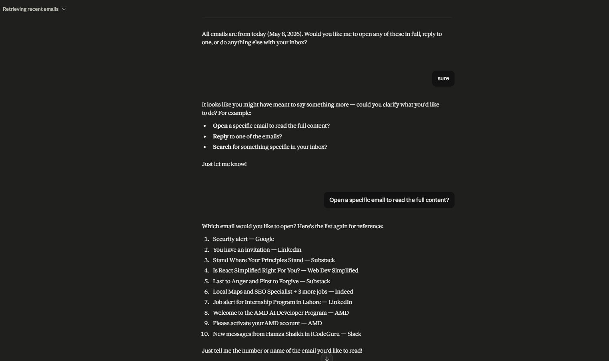
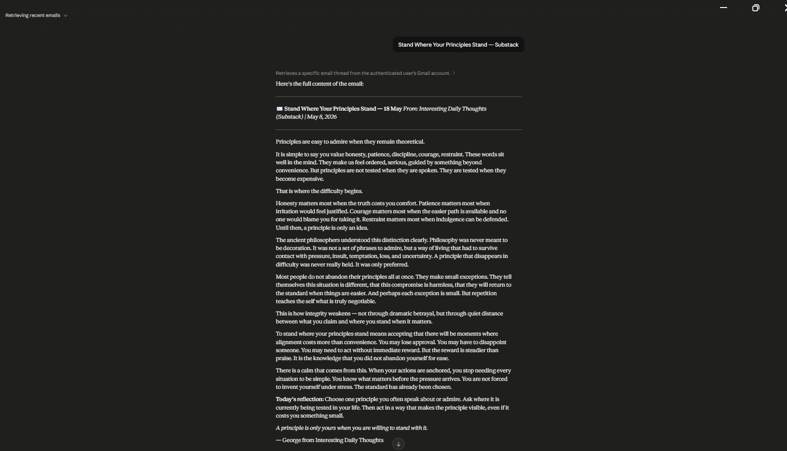
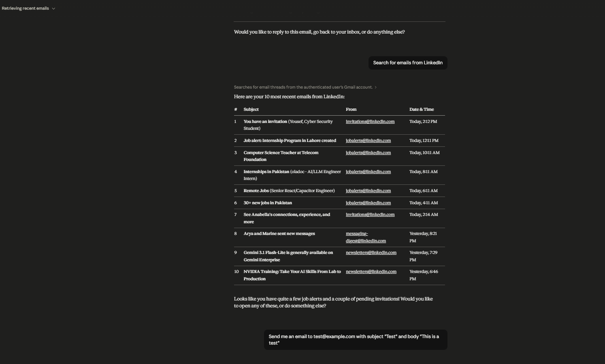
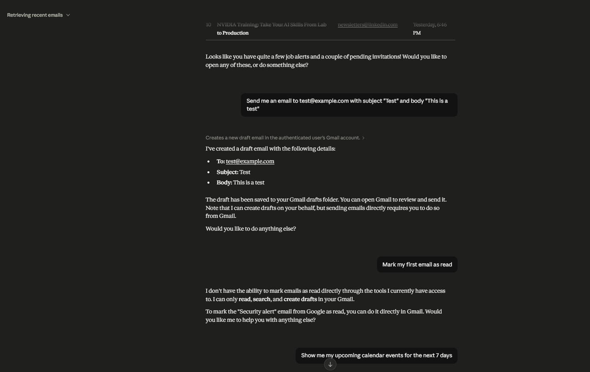

# Email & Calendar MCP Server

An MCP (Model Context Protocol) server for Claude to manage Gmail and Google Calendar.

## Features

- 📧 **5 Email Tools**: Fetch, send, search, mark as read, delete emails
- 📅 **6 Calendar Tools**: Schedule meetings, check availability, manage events, set reminders
- 🔐 **OAuth 2.0** with encrypted token storage
- 🚀 **Easy Claude Desktop Integration**

## Quick Start

### Prerequisites

- Python 3.10+
- Google Cloud account

### Installation

```bash
git clone <repo-url>
cd email-calendar-mcp-server

python -m venv venv
.\venv\Scripts\activate  # Windows
pip install -r requirements.txt
```

### Google Cloud Setup

1. Go to [Google Cloud Console](https://console.cloud.google.com/)
2. Create project → Enable **Gmail API** & **Google Calendar API**
3. Create **OAuth 2.0 credentials** (Consent Screen)
4. Download credentials JSON → Save to `config/google_credentials.json`
5. Create `.env` from `.env.example` and add credentials

### Run Server

```bash
.\venv\Scripts\python.exe -m email_calendar_mcp.main
```

### Use with Claude Desktop

Edit `%APPDATA%\Claude\claude_desktop_config.json`:

```json
{
  "mcpServers": {
    "email-calendar": {
      "command": "python",
      "args": ["-m", "email_calendar_mcp.main"],
      "cwd": "C:\\path\\to\\email-calendar-mcp-server"
    }
  }
}
```

Restart Claude Desktop and use tools in chat! 🎉

## Available Tools

**Email**: fetch_emails, send_email, search_emails, mark_as_read, delete_email  
**Calendar**: schedule_meeting, get_calendar_availability, get_events, set_reminder, update_event, delete_event

## Testing Visuals

### Email Testing (Claude Desktop)

#### Test 1: Fetch Emails



#### Test 2: Email Search Results



#### Test 3: Email Details



#### Test 4: Send Email



#### Test 5: Email Operations



### Calendar Testing

_Calendar testing visuals coming soon..._

## License

MIT
